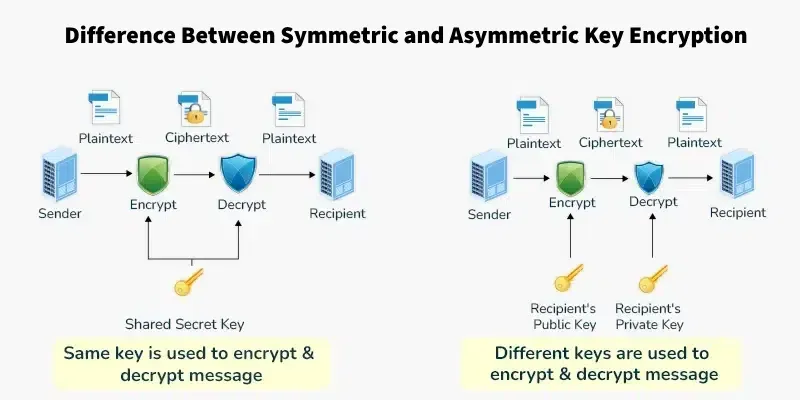

# Symmetric vs Asymmetric Encryption

## Overview

Encryption is essential for secure data transmission. Here's a comparison between symmetric and asymmetric encryption methods.

## Symmetric Encryption

- Uses the same key for encryption and decryption
- Faster and simpler than asymmetric encryption
- Common algorithms: AES, DES, 3DES

## Asymmetric Encryption

- Uses different keys (public and private) for encryption and decryption
- More complex but more secure for key exchange
- Common algorithms: RSA, ECC

## Visual Comparison

## Key Differences

1. **Key Usage**

   - Symmetric: Single key
   - Asymmetric: Key pair (public + private)

2. **Speed**

   - Symmetric: Faster
   - Asymmetric: Slower but more secure

3. **Security Level**
   - Symmetric: Requires secure key exchange
   - Asymmetric: More secure key distribution
