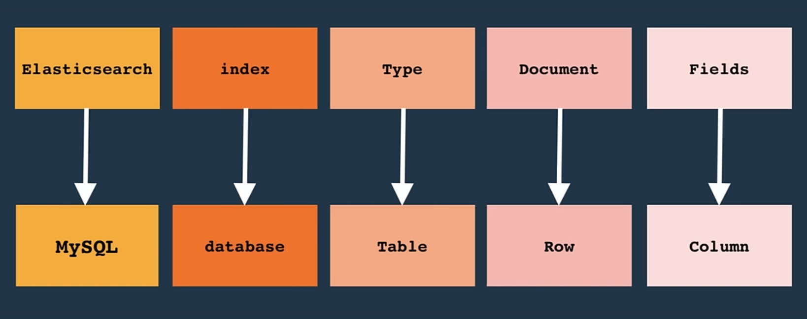

# Elasticsearch Reference Guide

## What is Elasticsearch?

Elasticsearch is a distributed, RESTful search and analytics engine built on Apache Lucene. It's designed for horizontal scalability, real-time search, and analyzing large volumes of data.

## Key Concepts

### Index

A collection of documents with similar characteristics (like a database).

### Document

A basic unit of information that can be indexed (like a row in a database).

### Type

A logical category/partition of your index (deprecated in 7.x+).

### Mapping

Defines how documents and their fields are stored and indexed.

### Shard

A subset of an index distributed across nodes for scalability.

### Replica

A copy of a shard for redundancy and increased search performance.



## Basic Operations

### 1. Index Management

**Create Index:**

```bash
PUT /my-index
{
  "settings": {
    "number_of_shards": 1,
    "number_of_replicas": 1
  }
}
```

**Delete Index:**

```bash
DELETE /my-index
```

**List All Indices:**

```bash
GET /_cat/indices?v
```

### 2. Document Operations

**Index Document:**

```bash
PUT /products/_doc/1
{
  "name": "iPhone 14",
  "price": 999,
  "category": "electronics",
  "description": "Latest smartphone from Apple"
}
```

**Get Document:**

```bash
GET /products/_doc/1
```

**Update Document:**

```bash
POST /products/_update/1
{
  "doc": {
    "price": 899
  }
}
```

**Delete Document:**

```bash
DELETE /products/_doc/1
```

### 3. Search Operations

#### 3.1 Simple Search Examples

**Query String Search:**

```bash
GET /products/_search?q=title:123    # Search in title field
GET /products/_search?q=*:*          # Match all documents
```

**Basic Search:**

```bash
GET /products/_search
{
  "query": {
    "match": {
      "name": "iPhone"
    }
  }
}
```

#### 3.2 Advanced Search Examples

**Match All with Sorting and Field Selection:**

```bash
GET /products/_search
{
  "query": {
    "match_all": {}
  },
  "from": 0,
  "size": 10,
  "sort": {
    "price": {
      "order": "desc"
    }
  },
  "_source": ["title", "price"]
}
```

**Match with Field Selection:**

```bash
GET /products/_search
{
  "query": {
    "match": {
      "title": "ip 16"
    }
  },
  "from": 0,
  "size": 1,
  "_source": ["title", "price"]
}
```

**Bool Query with Multiple Conditions:**

```bash
GET /products/_search
{
  "query": {
    "bool": {
      "must": [
        {
          "match": {
            "title": "ip 161111"
          }
        },
        {
          "match": {
            "price": 1000
          }
        }
      ],
      "filter": {
        "range": {
          "price": {
            "gt": 500
          }
        }
      }
    }
  }
}
```

**Exact Match with Highlighting:**

```bash
GET /products/_search
{
  "query": {
    "match_phrase": {
      "title": "ip 16 128 GB"
    }
  },
  "highlight": {
    "fields": {
      "title": {}
    }
  }
}
```

#### 3.3 Aggregation Examples

**Group by Field:**

```bash
GET /products/_search
{
  "aggs": {
    "price_group": {
      "terms": {
        "field": "price"
      }
    }
  },
  "size": 0
}
```

**Average of Field:**

```bash
GET /products/_search
{
  "aggs": {
    "price_group": {
      "avg": {
        "field": "price"
      }
    }
  },
  "size": 0
}
```

**Match Phrase Query:**

```bash
GET /products/_search
{
  "query": {
    "match_phrase": {
      "title": "123456"
    }
  }
}
```

**Match All:**

```bash
GET /products/_search
{
  "query": {
    "match_all": {}
  }
}
```

**Term Query (Exact Match):**

```bash
GET /products/_search
{
  "query": {
    "term": {
      "category": "electronics"
    }
  }
}
```

**Range Query:**

```bash
GET /products/_search
{
  "query": {
    "range": {
      "price": {
        "gte": 500,
        "lte": 1000
      }
    }
  }
}
```

**Bool Query (Complex):**

```bash
GET /products/_search
{
  "query": {
    "bool": {
      "must": [
        { "match": { "category": "electronics" } }
      ],
      "filter": [
        { "range": { "price": { "gte": 100 } } }
      ],
      "must_not": [
        { "term": { "discontinued": true } }
      ]
    }
  }
}
```

### 4. Aggregations

**Terms Aggregation:**

```bash
GET /products/_search
{
  "size": 0,
  "aggs": {
    "categories": {
      "terms": {
        "field": "category"
      }
    }
  }
}
```

**Average Price:**

```bash
GET /products/_search
{
  "size": 0,
  "aggs": {
    "avg_price": {
      "avg": {
        "field": "price"
      }
    }
  }
}
```

**Date Histogram:**

```bash
GET /sales/_search
{
  "size": 0,
  "aggs": {
    "sales_over_time": {
      "date_histogram": {
        "field": "date",
        "calendar_interval": "month"
      }
    }
  }
}
```

## Mapping & Settings

### Create Index with Mapping:

```bash
PUT /products
{
  "mappings": {
    "properties": {
      "name": {
        "type": "text",
        "analyzer": "standard"
      },
      "price": {
        "type": "float"
      },
      "category": {
        "type": "keyword"
      },
      "created_at": {
        "type": "date"
      },
      "tags": {
        "type": "keyword"
      }
    }
  }
}
```

### Update Mapping:

```bash
PUT /products/_mapping
{
  "properties": {
    "brand": {
      "type": "keyword"
    }
  }
}
```

## Common Field Types

- **text**: Full-text search
- **keyword**: Exact values, filtering, sorting
- **integer/long**: Numeric values
- **float/double**: Decimal numbers
- **date**: Date/time values
- **boolean**: true/false
- **object**: JSON objects
- **nested**: Array of objects

## Useful Commands

### Cluster Health:

```bash
GET /_cluster/health
```

### Node Information:

```bash
GET /_nodes
```

### Index Statistics:

```bash
GET /products/_stats
```

### Bulk Operations:

```bash
POST /_bulk
{ "index": { "_index": "products", "_id": "1" } }
{ "name": "Product 1", "price": 100 }
{ "index": { "_index": "products", "_id": "2" } }
{ "name": "Product 2", "price": 200 }
```

### Reindex:

```bash
POST /_reindex
{
  "source": {
    "index": "old-index"
  },
  "dest": {
    "index": "new-index"
  }
}
```

## Performance Tips

1. **Use appropriate field types** (keyword vs text)
2. **Limit the number of shards** (1-5 for most use cases)
3. **Use filters instead of queries** when possible
4. **Avoid deep pagination** (use scroll API for large datasets)
5. **Optimize mappings** (disable \_source if not needed)
6. **Use routing** for better performance
7. **Monitor cluster health** regularly

## Security Basics

### Enable Security:

```yaml
# elasticsearch.yml
xpack.security.enabled: true
```

### Create User:

```bash
POST /_security/user/my_user
{
  "password": "my_password",
  "roles": ["superuser"]
}
```

### Index-level Security:

```bash
POST /_security/role/product_reader
{
  "indices": [{
    "names": ["products"],
    "privileges": ["read"]
  }]
}
```

## Common Use Cases

1. **Full-text search** (e-commerce, documentation)
2. **Log analysis** (ELK stack)
3. **Real-time analytics** (dashboards, metrics)
4. **Geospatial search** (location-based services)
5. **Autocomplete** (search suggestions)
6. **Data aggregation** (business intelligence)

## Best Practices

- Plan your index structure carefully
- Use appropriate analyzers for text fields
- Monitor disk usage and performance
- Implement proper backup strategies
- Use aliases for zero-downtime reindexing
- Keep Elasticsearch version updated
- Use appropriate hardware (SSD, sufficient RAM)

## Troubleshooting

### Common Issues:

- **Yellow cluster status**: Unassigned replicas
- **High memory usage**: Adjust heap size
- **Slow queries**: Check mappings and query structure
- **Split brain**: Configure discovery settings properly

**Quick Answer: What Happens? When you delete then update in the same bulk operation**
❌ DELETE → UPDATE (without upsert):
Delete: ✅ Success - document deleted
Update: ❌ Fails with document_missing_exception
Result: Document remains deleted

✅ DELETE → UPDATE (with upsert):
Delete: ✅ Success - document deleted
Update: ✅ Success - document recreated via upsert
Result: New document exists with upserted content

✅ DELETE → INDEX:
Delete:✅ Success - document deleted
Index: ✅ Success - new document created
Result: Document completely replaced
