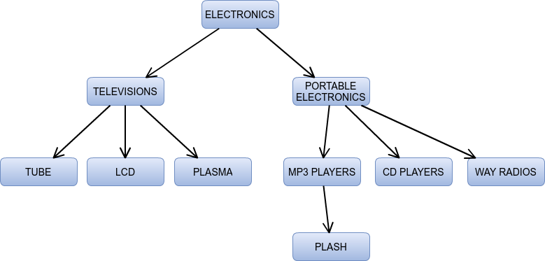
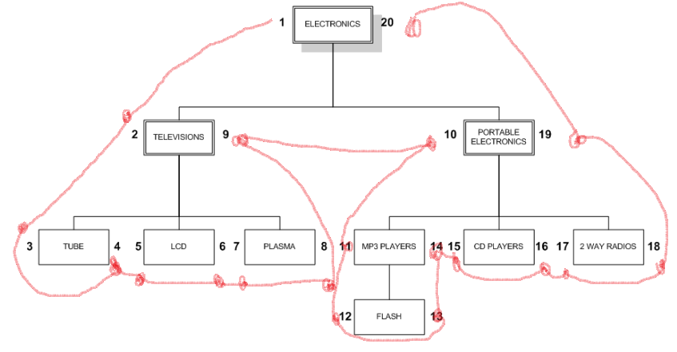

# Hierarchical Data Structure

## Parent-child model

This approach adds a parent_id field to store information about each node's parent.
Example Structure:

| ID  | Name                 | Parent_ID |
| --- | -------------------- | --------- |
| 1   | ELECTRONICS          | NULL      |
| 2   | TELEVISIONS          | 1         |
| 3   | PORTABLE ELECTRONICS | 1         |
| 4   | TUBE                 | 2         |
| 5   | LCD                  | 2         |
| 6   | PLASMA               | 2         |
| 7   | MP3 PLAYERS          | 3         |
| 8   | CD PLAYERS           | 3         |
| 9   | 2 WAY RADIOS         | 3         |



## Materialized Path

Similar to parent-child but instead of parent_id, it uses a path column to store the complete path from root to current node.

Example Structure:

| ID  | Name                 | Path  |
| --- | -------------------- | ----- |
| 1   | ELECTRONICS          | 1     |
| 2   | TELEVISIONS          | 1/2   |
| 3   | PORTABLE ELECTRONICS | 1/3   |
| 4   | TUBE                 | 1/2/4 |
| 5   | LCD                  | 1/2/5 |
| 6   | PLASMA               | 1/2/6 |
| 7   | MP3 PLAYERS          | 1/3/7 |
| 8   | CD PLAYERS           | 1/3/8 |
| 9   | 2 WAY RADIOS         | 1/3/9 |

## Nested set model

The Nested Set Model represents hierarchical data as nested sets, where parent nodes encompass all their child nodes.

How it works:

- Each node is traversed twice during a depth-first traversal
  Numbers are assigned from left to right
  Each node gets two values: left and right
  Parent nodes have larger ranges that contain their children's ranges

Visual Representation as Nested Sets:

```text
┌─────────────────────────────────────────────────────────────┐
│ ELECTRONICS (1,18)                                          │
│ ┌─────────────────────────┐  ┌─────────────────────────────┐│
│ │ TELEVISIONS (2,9)       │  │ PORTABLE ELECTRONICS (10,17)││
│ │ ┌─────┐ ┌─────┐ ┌─────┐ │  │ ┌─────┐ ┌─────┐ ┌─────────┐ ││
│ │ │TUBE │ │ LCD │ │PLASM│ │  │ │ MP3 │ │ CD  │ │2 WAY    │ ││
│ │ │(3,4)│ │(5,6)│ │(7,8)│ │  │ │(11,12)│(13,14)│RADIOS   │ ││
│ │ └─────┘ └─────┘ └─────┘ │  │ └─────┘ └─────┘ │(15,16)  │ ││
│ └─────────────────────────┘  └─────────────────────────────┘│
└─────────────────────────────────────────────────────────────┘
```

Table Representation:

| ID  | Name                 | Left | Right |
| --- | -------------------- | ---- | ----- |
| 1   | ELECTRONICS          | 1    | 18    |
| 2   | TELEVISIONS          | 2    | 9     |
| 3   | TUBE                 | 3    | 4     |
| 4   | LCD                  | 5    | 6     |
| 5   | PLASMA               | 7    | 8     |
| 6   | PORTABLE ELECTRONICS | 10   | 17    |
| 7   | MP3 PLAYERS          | 11   | 12    |
| 8   | CD PLAYERS           | 13   | 14    |
| 9   | 2 WAY RADIOS         | 15   | 16    |



Use **Parent-Child** Model when:

- Working with simple data structures
- Few levels in hierarchy
- Fast retrieval is not critical
- Frequent insertions/updates

Use **Materialized Path** or **Nested Set Model** when:

- Working with deep hierarchies
- Multiple levels of data
- Fast data retrieval is essential
- Read operations are more frequent than write operations
