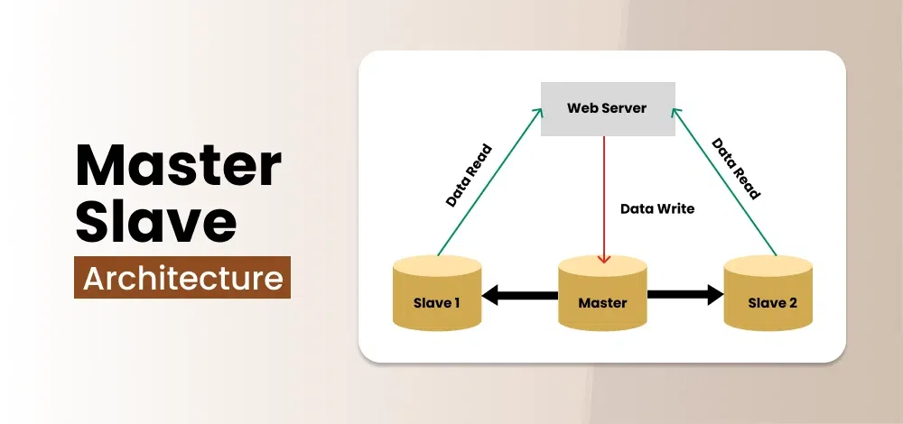

# Master-Slave Architecture

## Definition

A system design with one central "master" node controlling multiple "slave" nodes. Master assigns tasks, slaves execute and report back. Enables parallel processing and load balancing.

## Components

- **Master Node**: Central controller that delegates tasks and collects results
- **Slave Nodes**: Execute assigned tasks independently
- **Communication Protocol**: Rules for data exchange between nodes
- **Task Distribution**: Mechanism for efficient resource utilization
- **Feedback System**: Status reporting from slaves to master

## Data Flow Process

1. Master receives request and assigns tasks to slaves
2. Data transmitted from master to respective slaves
3. Slaves execute tasks independently
4. Results sent back to master
5. Master analyzes results and initiates further actions

## Replication Strategies

- **Synchronous**: Immediate copying, strong consistency, slower performance
- **Asynchronous**: Delayed copying, faster performance, potential data lag
- **Batch**: Periodic bulk copying during off-peak times

## Applications

- **Databases**: MySQL master-slave replication for redundancy
- **CDNs**: Content distribution across geographically dispersed servers
- **Parallel Computing**: High-performance computing clusters
- **Network Infrastructure**: Load balancing in routers and switches
- **Real-time Systems**: Gaming and financial trading platforms

## Real-World Examples

- MySQL database replication
- Apache Hadoop distributed computing
- CDN content distribution
- Network device traffic management

## MySQL Replication Master-Slave

### MySQL Replication

MySQL Replication is a technology that allows creating and maintaining multiple copies of MySQL databases through automatic replication from a master server to slave servers.

**How it Works** The master server stores the primary database serving applications, while slave servers store replica copies. All changes on the master are recorded in binary log format, which slaves read and execute corresponding operations to synchronize data. This binary read/write/execute process operates very quickly.

**Purpose** The concept addresses the need for data integrity and protection in large-scale database systems, creating identical database versions stored in different locations as a precaution against system failures.

**Benefits**

| Advantage               | Description                                                          | Benefits                                                                                                                                                          |
| ----------------------- | -------------------------------------------------------------------- | ----------------------------------------------------------------------------------------------------------------------------------------------------------------- |
| **Load Distribution**   | Reduces master server load by distributing read operations to slaves | • Writes happen on master, reads on slaves • Significantly improves overall system performance • Better resource utilization                                |
| **Data Security**       | Creates redundant data copies across multiple servers                | • Enables safe backup operations on slaves • Protects against data loss from server failures • High availability and fault tolerance                        |
| **Analytics Support**   | Allows data analysis on slaves without impacting master performance  | • Separates operational and analytical workloads • Enables intensive reporting without affecting production • Dedicated resources for business intelligence |
| **Remote Distribution** | Creates local data copies for remote locations                       | • Reduces network latency and master connections • Supports distributed architecture • Geographic data distribution capability                              |
