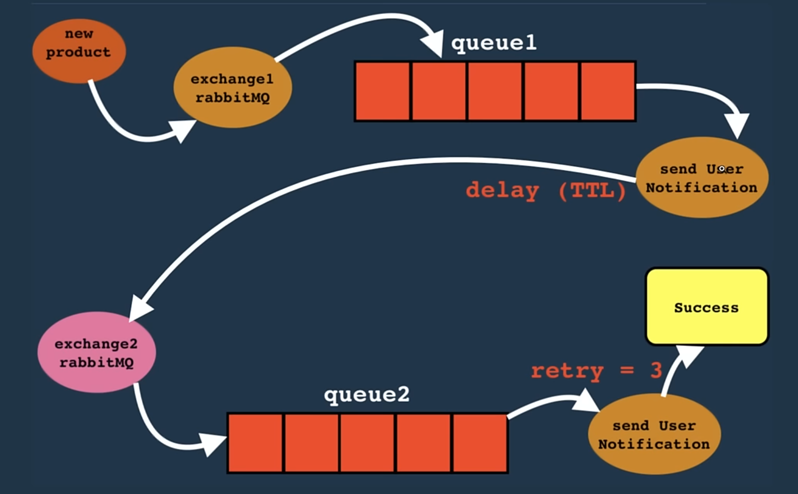

```New Words
DLX: Dead Letter Exchange
AMQP: Advanced Message Queuing Protocol
```

# RabbitMQ: Message Broker

## What is a Message Broker?

Software that enables applications to **communicate** and **exchange information** by translating messages between different messaging protocols. Allows services to talk regardless of programming language or platform.

## Message Queue Advantages

- **Decoupled applications** - producers and consumers don't need to know about each other
- **Asynchronous processing** - no waiting for responses
- **Load balancing** and **fault tolerance**
- **Easy scalability**

## What is RabbitMQ?

Open-source message broker implementing **AMQP** protocol, with plugins for STOMP, MQTT, HTTP, and WebSocket.

**When to use:**

- **Redis**: Short-lived messages
- **Kafka**: Large amounts of data
- **RabbitMQ**: Complex data requirements

## Core Components

- **Producers**: Send messages
- **Exchanges**: Route messages using routing keys and bindings
- **Queues**: Store messages until consumed
- **Consumers**: Receive and process messages

## Exchange Types

| Type       | Description                        |
| ---------- | ---------------------------------- |
| **Direct** | Exact routing key match            |
| **Topic**  | Pattern-based routing key matching |
| **Header** | Routes based on header values      |
| **Fanout** | Broadcasts to all bound queues     |

## Message Flow

1. Producer → Exchange
2. Exchange → Queue(s) (based on routing rules)
3. Consumer subscribes to queue
4. Message consumed and removed

## Key Concepts

### Message Reliability

- **Acknowledgments**: Manual vs auto confirmation
- **Durability**: Queues/messages survive restarts
- **Dead Letter Exchanges**: Handle failed messages

### Best Practices

- Use **connection pooling**
- Implement **SSL/TLS** for production
- Monitor **queue lengths**
- Set **message TTL** to prevent buildup
- Use **virtual hosts** for separation

### Common Patterns

- **Work Queue**: Multiple workers, load balancing
- **Pub/Sub**: Broadcast to multiple subscribers
- **RPC**: Request/reply with correlation IDs

## When NOT to Use RabbitMQ

- Real-time streaming → **Kafka**
- Simple caching → **Redis**
- Massive scale (millions msg/sec) → **Kafka/Pulsar**

## DLX: Dead Letter Exchange

Dead-lettering in RabbitMQ occurs when messages are republished to an exchange due to specific events:

- **Negative acknowledgment**: The message is explicitly rejected by an AMQP receiver or consumer.

- **Expiration**: The message has exceeded its time-to-live (TTL).

- **Queue overflow**: The message is dropped because the queue exceeds its length limit.

- **Delivery limit exceeded**: The message is returned more times than the allowed threshold in a quorum queue.


TTL: Time to Live
