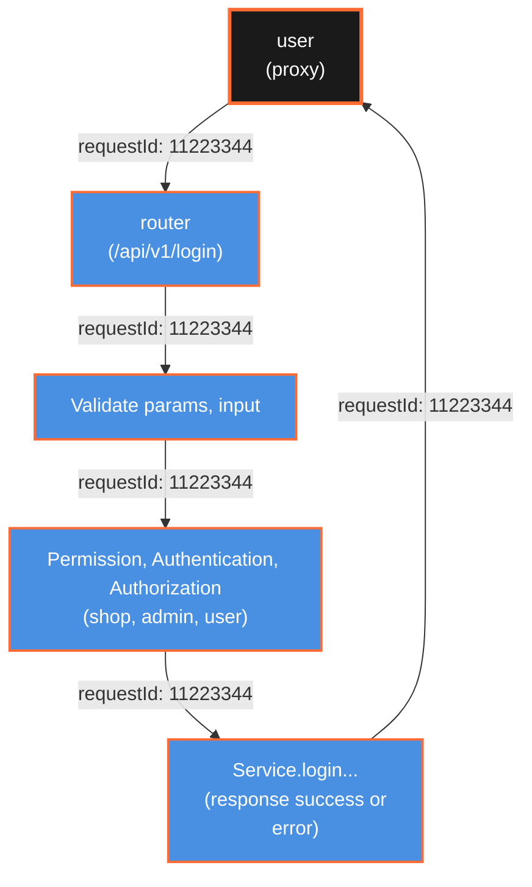

## Why Do We Need Trace ID or Request ID in Backend Logging?

When developing backend systems, it's crucial to track and debug requests as they flow through various services and components. This is where **trace IDs** or **request IDs** become essential.

### Key Reasons:

- **End-to-End Tracking:** Assigning a unique ID to each request allows you to trace its journey across microservices, APIs, and databases.
- **Simplified Debugging:** When an error occurs, you can search logs using the request ID to quickly find all related log entries.
- **Performance Monitoring:** Helps in measuring the time taken by each part of the system to process a request.
- **Correlation Across Services:** In distributed systems, a trace ID enables correlation of logs from different services handling the same request.
- **Improved Support:** When users report issues, providing a request ID helps engineers quickly locate relevant logs.

## Common Log Levels Explained

Logging frameworks typically support several log levels to categorize the importance and type of messages:

| Level     | Description                                                                                         | Example Use Case                             |
| --------- | --------------------------------------------------------------------------------------------------- | -------------------------------------------- |
| **TRACE** | Most detailed information, typically of interest only when diagnosing problems.                     | Entering/exiting functions, variable values. |
| **DEBUG** | Fine-grained informational events useful for debugging an application.                              | Debugging logic, internal state changes.     |
| **INFO**  | General operational entries about application progress.                                             | Successful startup, user logins.             |
| **WARN**  | Indications of potential problems or situations that are unexpected, but the application continues. | Deprecated API usage, slow responses.        |
| **ERROR** | Error events that might still allow the application to continue running.                            | Failed database connection, exceptions.      |
| **FATAL** | Very severe error events that will presumably lead the application to abort.                        | Unrecoverable system failures.               |

Choosing the appropriate log level helps filter and prioritize log messages, making it easier to monitor and troubleshoot systems effectively.
