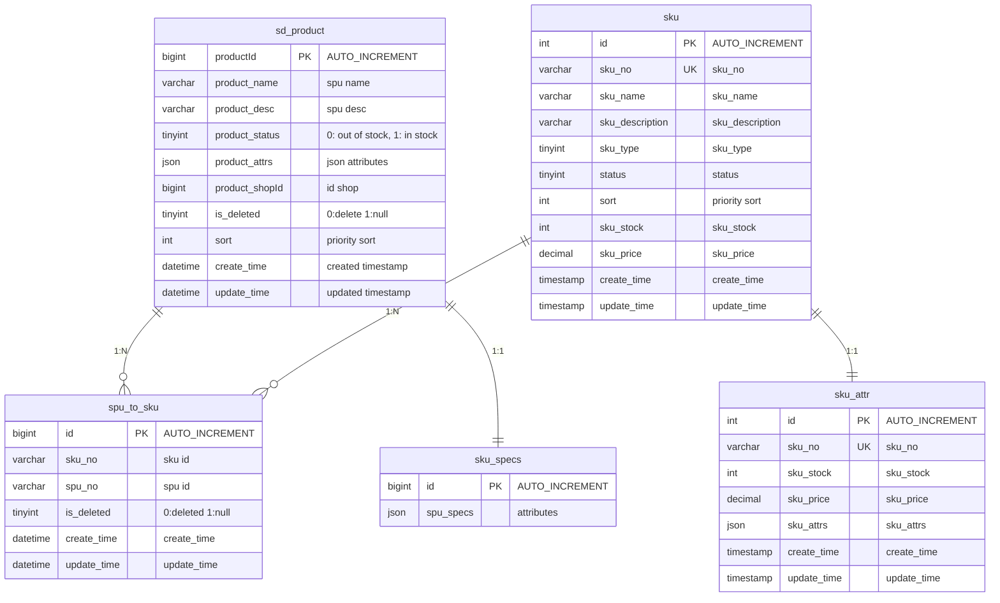

# SKU and SPU

**SKU (Stock Keeping Unit)** and **SPU (Standard Product Unit)** are inventory management concepts that help businesses organize and track their products, but they work at different levels of detail.

## SKU (Stock Keeping Unit)

Think of a SKU as a unique "fingerprint" for each specific variation of a product. It's the most detailed level of product identification.

**What makes a SKU unique:**

- Every different variation gets its own SKU
- Changes in size, color, material, packaging, or any other attribute create a new SKU
- Even the same product sold in different locations might have different SKUs

**Example:**
Let's say you're selling a t-shirt:

- Red t-shirt, size Medium = SKU: RED-TSHIRT-M-001
- Red t-shirt, size Large = SKU: RED-TSHIRT-L-001
- Blue t-shirt, size Medium = SKU: BLUE-TSHIRT-M-001
- Blue t-shirt, size Large = SKU: BLUE-TSHIRT-L-001

Each combination gets its own unique SKU code.

## SPU (Standard Product Unit)

An SPU groups together all the different SKUs that represent the same basic product. It's like a "family" that contains all the variations.

**What an SPU represents:**

- The core product concept, regardless of variations
- Groups all related SKUs under one umbrella
- Used for broader product management and analysis

**Using the same t-shirt example:**

- SPU: "Cotton T-Shirt Style #001"
- This SPU would contain all the SKUs: RED-TSHIRT-M-001, RED-TSHIRT-L-001, BLUE-TSHIRT-M-001, BLUE-TSHIRT-L-001

## Key Differences

**Granularity:**

- SKUs are highly specific (every variation is separate)
- SPUs are broader (one product concept with multiple variations)

**Use Cases:**

- SKUs are used for inventory tracking, warehouse management, and point-of-sale systems
- SPUs are used for product catalog management, marketing analysis, and reporting

**Customer Perspective:**

- Customers typically see SPUs on product pages (one main product)
- They select specific attributes that determine which SKU they're actually buying

## Real-World Application

Imagine an online store selling shoes:

**SPU Level:** "Nike Air Max 270"

- This is what customers see as the main product

**SKU Level:** Each specific combination

- Nike Air Max 270, Black, Size 9, Men's = SKU: NIKE-AM270-BLK-9-M
- Nike Air Max 270, Black, Size 10, Men's = SKU: NIKE-AM270-BLK-10-M
- Nike Air Max 270, White, Size 9, Men's = SKU: NIKE-AM270-WHT-9-M

The store's inventory system tracks each SKU individually, but marketing reports might analyze performance at the SPU level to understand how well the "Nike Air Max 270" product line is doing overall.

This system helps businesses maintain accurate inventory while also being able to analyze broader product trends and customer preferences.

## Summary

- **SKU**: Specific product variations (size, color, etc.) - used for detailed inventory tracking
- **SPU**: Product families that group related SKUs - used for broader analysis and catalog management
- Both are essential for effective inventory management and business analytics

Database Example MySQL:



```sql
-- tb_spu

CREATE TABLE `sd_product` (
  `productId` bigint(20) unsigned NOT NULL AUTO_INCREMENT COMMENT 'id',
  `product_name` varchar(64) DEFAULT NULL COMMENT 'spu name',
  `product_desc` varchar(256) DEFAULT NULL COMMENT 'spu desc',
  `product_status` tinyint(4) DEFAULT NULL COMMENT '0: out of stock, 1: in stock ',
  `product_attrs` json DEFAULT NULL COMMENT 'json attributes',
  `product_shopId` bigint(20) DEFAULT NULL COMMENT 'id shop',
  `is_deleted` tinyint(1) unsigned DEFAULT '0' COMMENT '0:delete 1:null',
  `sort` int(10) DEFAULT '0' COMMENT 'piority sort',
  `create_time` datetime DEFAULT CURRENT_TIMESTAMP COMMENT 'created timestamp',
  `update_time` datetime DEFAULT CURRENT_TIMESTAMP COMMENT 'updated timestamp',
  PRIMARY KEY (`id`) USING BTREE
) ENGINE=InnoDB DEFAULT CHARSET=utf8mb4 COMMENT='spu';

-- tb_sku

CREATE TABLE `sku` (
  `id` int(11) NOT NULL AUTO_INCREMENT,
  `sku_no` varchar(32) DEFAULT '' COMMENT 'sku_no',
  `sku_name` varchar(50) DEFAULT NULL COMMENT 'sku_name',
  `sku_description` varchar(256) DEFAULT NULL COMMENT 'sku_description',
  `sku_type` tinyint(4) DEFAULT NULL COMMENT 'sku_type',
  `status` tinyint(4) NOT NULL COMMENT 'status',
  `sort` int(10) DEFAULT '0' COMMENT 'piority sort',
  `sku_stock` int(11) NOT NULL DEFAULT '0' COMMENT 'sku_stock',
  `sku_price` decimal(8,2) NOT NULL COMMENT 'sku_price',
  `create_time` timestamp NOT NULL DEFAULT CURRENT_TIMESTAMP COMMENT 'create_time',
  `update_time` timestamp NULL DEFAULT NULL ON UPDATE CURRENT_TIMESTAMP COMMENT 'update_time',
  PRIMARY KEY(`id`) USING BTREE,
  UNIQUE KEY `uk_sku_no` (`sku_no`) USING BTREE
) ENGINE = InnoDB AUTO_INCREMENT = 1 DEFAULT CHARSET = utf8mb4 COMMENT = 'sku'

-- tb_sku_attr

CREATE TABLE `sku_attr` (
  `id` int(11) NOT NULL AUTO_INCREMENT,
  `sku_no` varchar(32) DEFAULT '' COMMENT 'sku_no',
  `sku_stock` int(11) NOT NULL DEFAULT '0' COMMENT 'sku_stock',
  `sku_price` decimal(8,2) NOT NULL COMMENT 'sku_price',
  `sku_attrs` json DEFAULT NULL COMMENT 'sku_attrs',
  `create_time` timestamp NOT NULL DEFAULT CURRENT_TIMESTAMP COMMENT 'create_time',
  `update_time` timestamp NULL DEFAULT NULL ON UPDATE CURRENT_TIMESTAMP COMMENT 'update_time',
  PRIMARY KEY(`id`) USING BTREE,
  UNIQUE KEY `uk_sku_no` (`sku_no`) USING BTREE
) ENGINE = InnoDB AUTO_INCREMENT = 1 DEFAULT CHARSET = utf8mb4 COMMENT = 'sku_attr'


-- tb_sku_specs

CREATE TABLE `sku_attr` (
  `id` bigint(20) unsigned NOT NULL AUTO_INCREMENT COMMENT 'id',
  `spu_specs` json DEFAULT NULL COMMENT 'attributes',
  PRIMARY KEY (`id`) USING BTREE
) ENGINE=InnoDB DEFAULT CHARSET=utf8mb4 COMMENT='spu';


-- tb_spu_to_sku

CREATE TABLE `spu_to_sku` (
  `id` bigint(11) unsigned NOT NULL AUTO_INCREMENT COMMENT 'id',
  `sku_no` varchar(32) NOT NULL DEFAULT '' COMMENT 'sku id',
  `spu_no` varchar(32) NOT NULL DEFAULT '' COMMENT 'spu id',

  `is_deleted` tinyint(1) DEFAULT '0' COMMENT '0:deleted 1:nul',
  `create_time` datetime DEFAULT CURRENT_TIMESTAMP COMMENT 'create_time',
  `update_time` datetime DEFAULT CURRENT_TIMESTAMP COMMENT 'update_time',
  PRIMARY KEY (`id`) USING BTREE,
  KEY `idx_spu_to_sku` (`spu_no`,`sku_no`) USING BTREE
) ENGINE=InnoDB AUTO_INCREMENT=5 DEFAULT CHARSET=utf8mb4 COMMENT='spu_to_sku';
```
